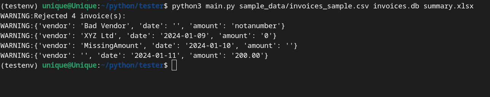
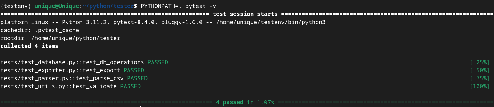

 🧾 InvoiceProcessor

**InvoiceProcessor** is a Python application that automates the handling of invoice data from CSV files. It parses invoices, validates them, stores them in an SQLite database, and exports vendor-level summaries to Excel. The project also includes a full testing suite to ensure stability and correctness.

---

## 🚀 Features

- ✅ **CSV Parsing** — Reads invoice data from structured CSV files
- 🧼 **Validation** — Rejects missing vendors, invalid dates, and non-numeric or negative amounts
- 🗃 **Database Storage** — Saves cleaned invoices to an SQLite database
- 📊 **Excel Export** — Generates a vendor summary Excel sheet showing total amounts
- 🧪 **Test Suite** — Covers all components (parser, database, exporter, utils) with `pytest`

---

## 🛠 Technologies Used

- Python 3
- `sqlite3` – lightweight SQL database
- `pandas` – data analysis and Excel export
- `openpyxl` – Excel writer
- `logging` – tracks and reports rejected records
- `pytest` – test suite included

---

## 📁 Project Structure

Project Structure
invoice_processor/
├── main.py # Main entry point
├── parser.py # CSV file reader
├── database.py # SQLite database logic
├── exporter.py # Excel export using pandas
├── utils.py # Validation and logging
├── requirements.txt # Dependencies
├── README.md
├── tests/ # Unit tests
│ ├── test_parser.py
│ ├── test_database.py
│ ├── test_exporter.py
│ └── test_utils.py
└── sample_data/
└── invoices_sample.csv

---

## How to Use
Install the required packages:
* `pip install -r requirements.txt`

Run the program:
* `python main.py sample_data/invoices_sample.csv invoices.db summary.xlsx`

What you get:
* A summary.xlsx Excel file with total amounts per vendor
* A local SQLite database file invoices.db
* Console logs showing any rejected rows (e.g., missing values or wrong formats)

---

## 🧪 Running Tests
Tests are written with pytest and cover every core component:

* `PYTHONPATH=. pytest -v`

✅ Example Output

🔍 What’s being tested?

|Test File                   | What It Validates                                             |
| ------------------------- |---------------------------------------------------------- |
|  test_parser.py         | Can the CSV be read and parsed correctly?     |
|  test_database.py     | Can the DB be created and data inserted?        |
|  test_exporter.py      |  Is Excel summary correctly generated?           |
|  test_utils.py            |  Are validations and rejections working?           |

 
